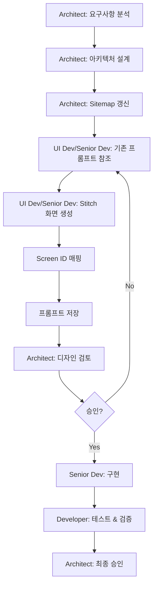
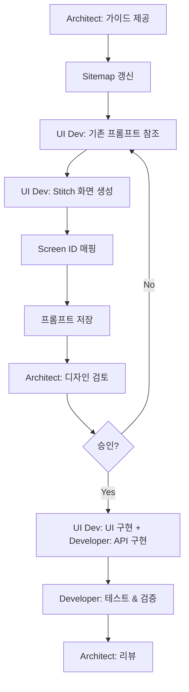
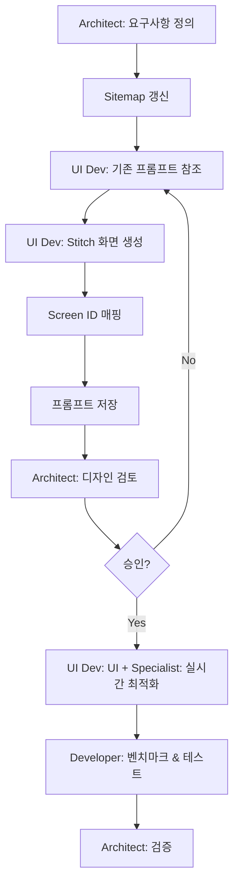

# Feature Development Workflow (Updated with Stitch MCP)

새로운 기능 개발 시 Stitch MCP 디자인을 포함한 표준 워크플로우입니다.

**모델**: Claude Opus 4.6 (Thinking), Claude Sonnet 4.6, Gemini 3 Flash

---

## 📋 워크플로우 종류

### 1. Critical Feature (결제, 보안, 재무)
```
Architect (설계) → Stitch Design → Senior Dev (구현) → Developer (테스트) → Architect (승인)
```

### 2. Standard Feature (일반 CRUD, UI)
```
Architect (가이드) → Stitch Design → UI Dev (UI) + Developer (API) → Developer (테스트) → Architect (리뷰)
```

### 3. Real-time Feature (클래스, 키오스크)
```
Architect (요구사항) → Stitch Design → UI Dev (UI) + Specialist (실시간) → Developer (벤치마크) → Architect (검증)
```

---

## 🎨 Stitch Design 단계 (공통)

모든 기능 개발에서 **구현 전 디자인 단계**는 필수입니다.

### 단계별 절차

1. **Sitemap 갱신** (Architect 주도)
   - `.docs/sitemap/README.md` 및 모듈별 파일 수정
   - 화면 경로, 기능, 데이터 요구사항 정의

2. **기존 프롬프트 참조** (UI Developer / 담당 Developer)
   - `.docs/stitch-prompts/apps/` 또는 `admin/` 확인
   - 유사 화면의 디자인 패턴 파악

3. **Stitch 화면 생성** (UI Developer / 담당 Developer)
   - `mcp_StitchMCP_generate_screen_from_text` 사용
   - 일관된 디자인 테마 적용

4. **Screen ID 매핑** (생성한 에이전트)
   - Sitemap에 생성된 Screen ID 기록
   - 추적성 확보

5. **프롬프트 저장** (생성한 에이전트)
   - `.docs/stitch-prompts/` 디렉토리에 저장
   - 향후 참조용 템플릿화

6. **디자인 검토** (Architect)
   - 일관성 확인
   - 필요시 수정 요청

---

## 📝 상세 워크플로우

### Critical Feature


### Standard Feature


### Real-time Feature


---

## 🎯 역할별 책임

### Architect (Opus 4.6 Thinking)
- **설계 단계**: 요구사항 정의 및 아키텍처 설계
- **디자인 단계**: Stitch 디자인 검토 및 승인
- **구현 단계**: 최종 리뷰 및 승인

### Senior Developer (Opus 4.6 Thinking)
- **구현 단계**: 복잡한 비즈니스 로직 (결제, 보안, 재무)
- **디자인 단계**: Admin Finance 등 복잡한 화면 참여

### Developer (Sonnet 4.6)
- **구현 단계**: API 개발, 데이터 통합
- **테스트 단계**: 모든 기능의 테스트 작성 및 품질 검증
- **문서 단계**: API 문서, 사용자 가이드, 변경 로그

### UI Developer (Gemini 3 Flash)
- **디자인 단계**: Stitch 화면 생성, 프롬프트 관리
- **구현 단계**: 모든 영역의 UI/UX 프론트엔드 구현

### Specialist (Gemini 3 Flash)
- **구현 단계**: 실시간 기능, 성능 최적화, 카메라/QR

---

## ⚠️ 필수 체크리스트

### Stitch Design 단계 (모든 Feature)
- [ ] Sitemap에 화면 정의됨
- [ ] 기존 프롬프트 참조함
- [ ] Stitch 화면 생성 성공
- [ ] Screen ID Sitemap에 매핑됨
- [ ] 생성 프롬프트 저장됨
- [ ] Architect 디자인 승인 받음

### 구현 단계 진입 조건
- [ ] 위 Stitch Design 체크리스트 100% 완료
- [ ] 디자인이 기존 화면과 일관성 유지
- [ ] 디자인 테마(Dark, Lexend, 8px, #ff6a00) 적용됨

---

## 🔗 관련 문서
- `.agent/workflows/design-screen.md` - Stitch 디자인 상세 워크플로우
- `.antigravity/config.json` - 에이전트 설정
- `.antigravity/README.md` - 멀티에이전트 시스템 개요

---

**Last Updated**: 2026-02-18  
**Version**: 3.0
