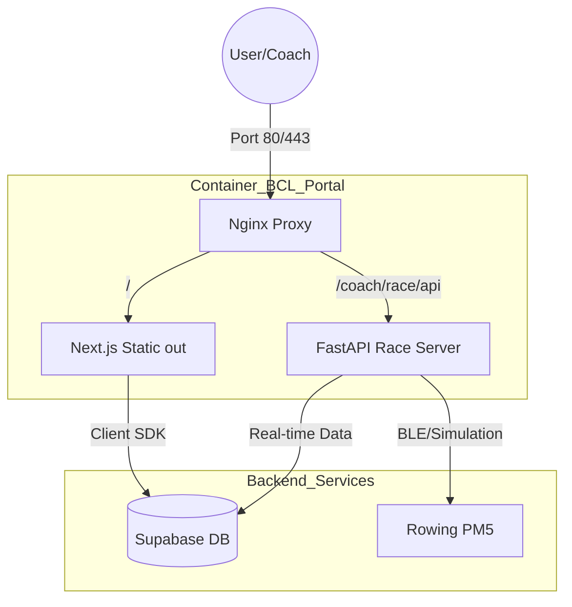

# BCL Portal - 통합 아키텍처 가이드 (Dual-Server Setup)

이 문서는 CSR 기반의 **Next.js(포털)**와 **FastAPI(레이스 엔진)** 서버를 물리적으로 분리 하되, 논리적으로는 하나의 앱처럼 동작하게 만드는 통합 아키텍처를 정의합니다.

---

## 1. 시스템 아키텍처 개요

프로젝트는 **Docker Compose**를 기반으로 두 개의 독립된 서비스가 협력하는 구조입니다.



---

## 2. 서버별 역할 정의

### A) Next.js Portal Server (Frontend)
- **역할**: 모든 유저 인터페이스(Admin, Apps, Coach) 제공.
- **특징**: `output: 'export'`를 통한 정적 배포. Nginx가 이를 서빙함.
- **통신**: Supabase Client SDK를 사용하여 DB와 직접 통신 (CSR).

### B) Python FastAPI Server (Race Engine)
- **역할**: 실시간 하드웨어 데이터 연동 및 경쟁 로직 처리.
- **특징**: WebSocket 지원을 통한 초저지연 리더보드 동기화.
- **통신**: 하드웨어(BLE) 및 Simulator 데이터 수집, 결과를 Supabase에 기록.

---

## 3. 통합 방식 (Proxy Strategy)

Nginx를 **Reverse Proxy**로 활용하여 클라이언트 측에서 CORS 이슈 없이 두 서버와 통신합니다.

### Nginx 설정 예시 (`nginx.conf`)
```nginx
location / {
    # Next.js 정적 파일 서빙
    root /usr/share/nginx/html;
    try_files $uri $uri/ /index.html;
}

location /coach/race/api/ {
    # 파이썬 서버로 요청 전달
    proxy_pass http://race-service:8000/;
    proxy_http_version 1.1;
    proxy_set_header Upgrade $http_upgrade;
    proxy_set_header Connection "upgrade";
}
```

---

## 4. 데이터 동기화 전략

1.  **참가자 정보**: 코치가 포털에서 회원 선택 시, Next.js가 해당 정보를 FastAPI로 전달.
2.  **실시간 순위**: FastAPI가 WebSocket으로 실시간 데이터 전송 → 코치 앱 레이스 화면에서 수신 및 렌더링.
3.  **최종 기록**: 경기 종료 후 FastAPI가 결과를 Supabase `race_results` 테이블에 `upsert`.

---

## 5. 구현 단계별 계획 (Implementation Roadmap)

| 단계 | 작업 내용 | 주요 도구 |
| :--- | :--- | :--- |
| **Phase 1** | **Docker 환경 통합** | `docker-compose.yml` 확장, 마이크로서비스 구조 설정 |
| **Phase 2** | **Reverse Proxy 설정** | Nginx를 통한 API 라우팅 통합 |
| **Phase 3** | **WebSocket 연동** | 코치 앱 프론트엔드와 파이썬 서버 간 실시간 통신 |
| **Phase 4** | **데이터 영속화** | 파이썬 서버 결과값 Supabase 저장 로직 구현 |

---
> [!IMPORTANT]
> 이 구조를 통해 하드웨어 제어의 복잡성(Python)과 유려한 웹 UI(Next.js)의 장점을 모두 취할 수 있습니다.
