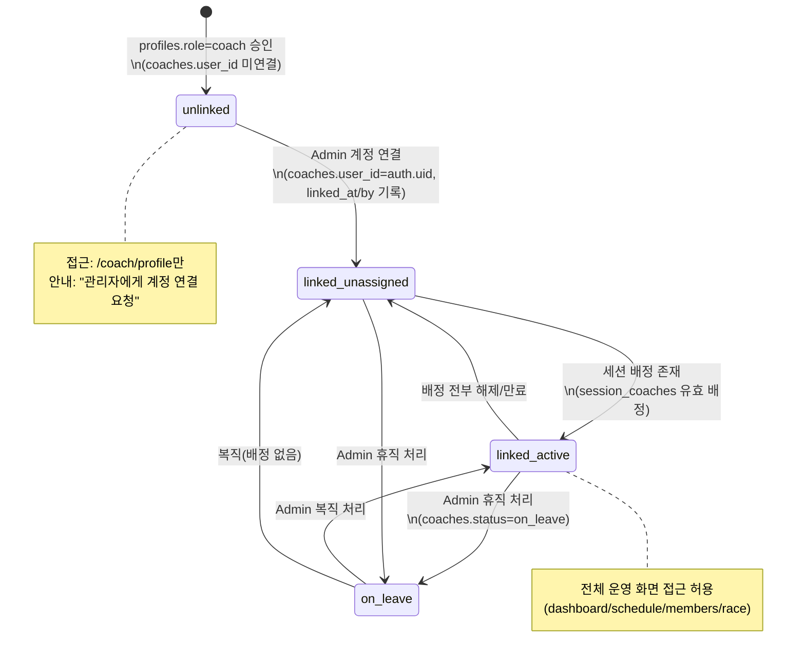

# 04. Coach 앱 — 코치 운영 OS (`/coach/*`)

> **재구축 설계서.** 표준 명칭·RPC·IA는 [`_source/contract.md`](./_source/contract.md)를 따른다.
> as-is 근거: [`_source/screens-inventory.md`](./_source/screens-inventory.md) §3, [`_source/nonfunctional-history.md`](./_source/nonfunctional-history.md) §시스템별 핵심 도메인 규칙.
> 데이터 계약(테이블 컬럼/RPC 시그니처 상세)은 `07-data-model.md` + `sql/`이 정본이며, 본 문서는 화면·UX·운영 규칙을 정의한다.
>
> 상태 표기: ✅ 운영 중 · 🟡 코드완료(검증 대기) · 🧪 mock · ⏳ 미구현 · 🔄 to-be 변경/통합

---

## 0. 문서 범위와 위상

Coach 앱은 **"코치가 수업 현장에서 손에 들고 쓰는 운영 OS"**다. 데스크탑 Admin이 "설정·정산·통제"라면, Coach 앱은 "오늘 수업을 굴리는 실행기"다. as-is에서 P0(운영 안정화)→P1-A(수업 표준화)→P1-B(정산 가시화)→P2(퍼포먼스·후속조치·Race 재통합)까지 완성된 도메인으로, 재구축에서는 **기능 축소 없이 RPC 표면 통합(§4)과 IA 강조점 이동(§2)** 만 반영한다.

- 대상 라우트(전수 8개): `/coach`(인덱스 리다이렉트), `/coach/dashboard`, `/coach/schedule`, `/coach/schedule/rotation`, `/coach/members`, `/coach/race`, `/coach/race/control`, `/coach/profile`
- 디바이스 프로파일: 모바일/태블릿 세로 우선(코칭 패드 가로 대응), `data-density=mobile`, 디자인 토큰 `--bcl-*` 단일 세트(12-design-system.md)
- Race의 하드웨어·파이프라인·화면 연출 상세는 **15-race-system.md로 위임**하고, 본 문서는 코치 관점 UX 계약만 정의한다(§3.5).

---

## 1. 제품 원칙 — 재구축 불변 규칙 (위반 = 리뷰 반려)

as-is 운영에서 검증된 아래 원칙을 재구축의 **불변 규칙(invariant)** 으로 명문화한다. 모든 Coach 도메인 코드 리뷰·수용 테스트는 이 6개 항목을 체크리스트로 사용한다.

### 1.1 코치앱 4대 전환 원칙

| # | 원칙 | 정의 | 구현 강제 수단 |
|---|------|------|----------------|
| ① | **세션 중심(Session-first)** | 코치의 모든 운영 행위(출결·WOD·런시트·Race·후속조치)는 "세션"을 축으로 조직된다. 회원 목록이 아니라 **오늘의 세션 보드**가 작업의 진입점이다. | IA에서 Schedule 탭을 중앙 강조(§2), 모든 운영 RPC가 `p_session_id`를 1급 파라미터로 받음 |
| ② | **서버 권한(Server-authoritative)** | 클라이언트는 `coach_id`를 절대 전달하지 않는다. 모든 코치 RPC는 `SECURITY DEFINER` + 내부 `auth.uid() → coaches.user_id → session_coaches.coach_id` 경로로 배정 여부를 서버가 직접 검증한다. | RPC 표준 계약(contract §3): envelope `{success, data, error}` 1종, 게이트 함수 `_assert_coach_or_admin` / `_assert_coach_can_edit_session` 공통화 |
| ③ | **사실 vs 판정 분리(Fact / Judgment)** | `checkins` = 물리적 입장 **사실**(키오스크/QR가 쓴다, 코치가 수정 불가). `bookings.attendance_outcome` = 코치의 운영 **판정**(no_show/late_cancel/coach_excused 등). 두 축을 한 컬럼에 합치지 않는다. | 별도 테이블/컬럼 유지, 판정 변경 시 `attendance_marked_by/at` 감사 기록 필수 |
| ④ | **코치 상태머신(Coach State Machine)** | 코치 계정은 `unlinked → linked_unassigned → linked_active (⇄ on_leave)` 상태를 가지며, 운영 화면 진입은 `linked_active`에서만 허용된다. 상태 판정은 `fn_get_my_coach_context()` 단일 소스. | 레이아웃 레벨 `CoachStateGate`(§4) — 화면별 개별 가드 재구현 금지 |

### 1.2 Admin·Coach 책임 분리 (정산)

- **Admin = 정산 실행 권한**: `fn_calculate_monthly_settlement`, `coach_settlements` 상태 전이(pending→confirmed→paid), 급여 단가(`base_salary`/`session_allowance`) 설정.
- **Coach = read-only 열람**: 코치는 자신의 정산 근거·예상액을 **조회만** 한다(`fn_get_coach_monthly_report`). 코치 앱에는 정산 관련 쓰기 UI를 두지 않는다.
- **동일 Basis 원칙**: 코치가 보는 예상 정산과 Admin이 확정하는 정산은 **같은 산식·같은 데이터**를 사용해야 한다. `예상정산 = base_salary + payable_sessions × session_allowance`. payable 판정 기준(세션 status=completed + lead/assistant 가중 여부)은 07-data-model의 단일 정의를 양쪽이 공유 — "코치 화면 따로 계산" 금지.

### 1.3 Display-Safe (공개 화면 정보 차단)

Coach 앱의 데이터가 TV/공개 화면(`/class/*`)으로 흘러갈 때, 다음 정보는 **어떤 경로로도 노출 금지**:

- 회원 부상/주의 플래그(`member_alert_flags`), 노트(`member_notes`), 후속조치(`coach_followups`)
- 운영 위험 지표(미체크인·노쇼 카운트의 회원 실명 매핑)
- 정산/급여 일체

강제 수단: 공개 화면 전용 RPC(`fn_get_class_display_wod` 등)는 위 필드를 **애초에 SELECT하지 않는** 별도 함수로 분리한다(응답에서 필터링하는 방식 금지). `session_wods.class_display_notes`처럼 "공개용으로 코치가 명시 작성한 필드"만 공개 표면에 존재할 수 있다.

---

## 2. as-is → to-be 메뉴 대조 (하단탭 5)

**결론: 5탭 구성 유지, 중앙(3번째) 강조 슬롯을 Members → Schedule로 교체.** 🔄

| 슬롯 | as-is | to-be | 변경/근거 |
|------|-------|-------|-----------|
| 1 | Home (`/coach/dashboard`) | Home (`/coach/dashboard`) | 유지. 위험 요약·follow-up 인박스 역할 |
| 2 | Schedule (`/coach/schedule`) | Members (`/coach/members`) | 슬롯 교환 |
| **3 (중앙 강조)** | **Members** | **Schedule (`/coach/schedule`)** 🔄 | **변경.** 근거: ① 4대 원칙 ①(세션 중심) — 코치 사용 로그상 최다 진입·최다 액션 화면은 세션 운영 보드이며, 출결·WOD·런시트·Race 시작·후속조치 생성이 모두 이 화면에서 발생 ② 회원 관리는 "세션 후 후속 작업"으로 빈도가 낮음 ③ 중앙 강조 버튼은 "지금 진행 중/임박 세션 보드로 1탭 직행" CTA로 동작해야 현장 조작 시간을 최소화 |
| 4 | Race (`/coach/race`) | Race (`/coach/race`) | 유지. 단, **수업 연동 레이스의 표준 경로는 세션 보드 → "Race 수업 시작"** 으로 확정(§3.5) — Race 탭은 허브(Live/기록/장비)+세션 미연동 이벤트 전용 |
| 5 | Profile (`/coach/profile`) | Profile (`/coach/profile`) | 유지. 급여 조회 RPC만 3종→1종 통합(§3.6) |

중앙 강조 슬롯의 동작 규칙:
- 진행 중 세션 존재 → 해당 **세션 운영 보드 직행** (탭 아이콘에 LIVE 도트)
- 60분 내 시작 세션 존재 → 해당 세션 보드 직행 (카운트다운 배지)
- 그 외 → `/coach/schedule` 일간 뷰

통폐합 없음(타 앱과 달리 Coach는 as-is에서 이미 화면 이중화가 없음). 라우트 구조 변경 없음 — 하위 라우트 `schedule/rotation`, `race/control` 유지.

---

## 3. 화면별 상세 명세

공통 규칙: 전 화면 CSR, `AuthGuard(role=coach)` + `CoachStateGate`(§4)를 레이아웃에서 1회 적용. 데이터 접근은 `rpc()` 헬퍼 경유(직접 fetch 금지), 비즈니스 테이블 참조는 `member_id`만(auth user_id 금지). Empty State 필수, Skeleton 권장, 파괴적 액션(노쇼 일괄 등) 확인 단계 필수.

### 3.1 Home — `/coach/dashboard` ✅→🔄

| 항목 | 내용 |
|------|------|
| 목적 | 출근 직후 30초 안에 "오늘 무엇이 위험한가"를 파악하는 브리핑 화면 |
| 데이터 | `fn_get_my_coach_dashboard()` (오늘 세션+운영 위험+경고 집계) + `fn_get_my_followups('open')` + `fn_get_coach_monthly_report(현재월, ['kpis'])` 🔄 |
| 권한 | linked_active 코치 본인 데이터만 (서버 판정) |

**위젯 구성 (상→하):**

1. **운영 위험 요약 카드** ✅ — 60분 내 시작 / 진행 중 미체크인 / 대기열 합계 3지표. 0이 아니면 해당 세션 보드 딥링크.
2. **오늘의 수업 리스트** ✅ — 배정 세션 카드(시간/제목/체크인·예약·대기 카운트/race 연동 배지). 탭 시 세션 보드 진입.
3. **회원 경고 위젯** ✅ — 활성 `member_alert_flags`를 flag_type별 집계(trial/injury/renewal_due/returning_after_absence/vip_attention). severity=critical 존재 시 위험 색 테두리(`--bcl-danger`), 탭 시 `/coach/members?flag=` 필터 진입. **오늘 내 세션 예약자 중 플래그 보유자를 우선 노출**(전체 시설 집계보다 실행 가능성 우선) 🔄.
4. **미완료 후속조치 위젯** ✅ — `fn_get_my_followups('open')`, 기한 초과(`is_overdue`) 상단 고정+위험 색, 카드에서 인라인 완료/해제(`fn_complete_followup`), 3건 초과 접기.
5. **KPI 스냅샷** 🔄 — `fn_get_coach_monthly_report(p_year_month, p_sections=['kpis'])`로 이달 진행 수업 수·출석률·리텐션 등 요약 3~4타일. as-is에서 profile에만 있던 KPI를 대시보드에 경량 노출(상세는 profile). 섹션 파라미터로 필요한 부분만 조회 — 대시보드에서 정산(basis) 섹션 호출 금지(Display-Safe 아님이지만 화면 책임 분리).
6. **다음 세션 CTA** ✅ — 진행 중 세션이 없을 때 가장 가까운 세션 보드로 이동하는 고정 하단 버튼.
7. **코치 공지** ✅ — Admin이 발행한 코치 대상 `notices` 필터 노출.

상태: 로딩=Skeleton, 오늘 세션 0건=명시적 Empty("오늘 배정 수업 없음"+주간 일정 링크), RPC 실패=에러 표면화+재시도(무한 스피너 금지 — 인증 계약 §7).

### 3.2 Schedule — `/coach/schedule` + 세션 운영 보드 ✅→🔄 (중앙 강조 탭)

| 항목 | 내용 |
|------|------|
| 목적 | 내 일정 확인 → 세션 운영 보드에서 수업 전·중·후 모든 실행 |
| 데이터 | 목록 `fn_get_coach_schedule(p_from, p_to)` / 보드 `fn_get_coach_session_board(p_session_id)` |
| 권한 | 본인 배정 세션만 목록·보드 접근(서버 검증). Admin은 전 세션 열람 가능 |

**일정 뷰**: 일간/주간 전환. 세션 카드 = 시간·제목·lead/assistant 구분(`session_coaches.assignment_role` + `display_order`)·체크인/예약/대기/노쇼/지각취소 카운트·race 연동 배지·WOD publish 상태 도트.

**세션 운영 보드** (세션 탭 시 바텀시트 92vh 또는 전면 전환):

#### (a) 출결 — 상태기계와 통합 RPC 🔄

출결 상태기계(`bookings.attendance_outcome`):

```
pending ──코치 판정──▶ checked_in | no_show | late_cancel | coach_excused
pending ──키오스크/QR──▶ checked_in
(예약 없음)──현장 등록──▶ walk_in
```

- **사실/판정 분리(원칙 ③)**: 키오스크 체크인은 `checkins`에 사실을 남기고 `attendance_outcome=checked_in`을 동기화한다. 코치는 사실(`checkins`)을 삭제·수정할 수 없고 판정만 변경한다.
- 판정 정정 허용: 종료 후 24h 내 판정 간 전이 가능(오조작 복구). 모든 전이에 `attendance_marked_by/at` 기록.
- **`fn_mark_attendance(p_session_id, p_items jsonb[])` 단일 RPC** 🔄 — as-is의 `fn_mark_session_attendance`(단건)+`fn_bulk_mark_session_attendance`(일괄)를 통합. 단건 = items 1개. 응답은 부분 성공 명세(`data.results[]`에 항목별 성공/실패 사유) — UI는 실패 항목만 표시·재시도. 일괄 액션("남은 인원 전원 노쇼" 등)은 확인 다이얼로그 필수.
- 보드 상단 **7개 출결 통계 그리드**(예약/체크인/대기/pending/no_show/late_cancel/coach_excused+walk_in) 실시간 재계산.
- **대기열 뷰**: waitlist 명단+우선순위. 승격은 서버 자동(`fn_notify_waitlist_on_vacancy` 경유) — 코치 수동 승격은 두지 않는다(Admin 권한).

#### (b) WOD 패널 (draft → publish) ✅

- `fn_get_session_wod` 로드 → 템플릿 선택(`fn_list_wod_templates` — benchmark/facility/shared 스코프) 또는 직접 편집.
- 동작 검색 `fn_search_wod_movements`(카테고리·장비 필터), movement line 편집(target/distance/duration/♂♀ RX load, `custom_label` fallback).
- **Save Draft** → `fn_upsert_session_wod`(publish_state=draft) / **Publish** → `fn_publish_session_wod`(movements_snapshot JSONB 동결 — publish 후 템플릿이 바뀌어도 세션 WOD 불변).
- 전광판 미리보기 = `fn_get_class_display_wod` 응답 그대로 렌더(TV와 동일 소스 — 미리보기 별도 조립 금지). 공개용 메모는 `class_display_notes` 필드에만 작성(Display-Safe §1.3).
- 🔄 레거시 `wods` 테이블·`sessions.wod_description` 완전 제거 — fallback 코드 이관 금지.

#### (c) 런시트 패널 (6탭 오버라이드) ✅

- 6탭: `warmup / movement_prep / scaling / cue / safety / finish_note`.
- 시설 템플릿(`class_runbook_templates`) 기본값 표시 + **"오버라이드로 복사"** → `session_runbooks.*_override`(NULL=템플릿 상속) 편집. 탭별 dirty 추적, 저장 `fn_upsert_session_runbook`.
- safety 탭은 세션 참가자의 활성 injury 플래그 요약을 코치에게만 인라인 표시 🔄(런시트 데이터에 저장하지 않음 — Display-Safe).

#### (d) 빠른 액션

- **Race 수업 시작** 🔄 — `fn_prepare_race_session(p_session_id, p_race_format)` 호출. **race_format(individual/team/group[+relay]) 선택 시트를 먼저 표시**한 뒤 호출(as-is는 포맷 파라미터 없이 생성 후 Control에서 선택 — to-be는 생성 시점 확정, 15-race-system §④-b). 서버는 배정 코치 검증 → 세션 연동 미종료 `race_events` 재개 또는 신규 생성 → 반환 event_id로 `/coach/race/control?event_id=` 자동 진입. **세션당 활성 이벤트 1개** 불변식은 서버가 보장.
- **후속조치 생성** ✅ — 세션 참석자 선택 → `fn_create_followup`(session_id 자동 연결, followup_type/priority/due_date/note).
- **서킷 콘솔 열기** → `/coach/schedule/rotation?session_id=`.

#### 3.2-1 Circuit Console — `/coach/schedule/rotation` ✅

| 항목 | 내용 |
|------|------|
| 목적 | 서킷 수업 팀 편성 + TV Rotation HUD(`/class/rotation-hud`) 원격 제어 리모컨 |
| 데이터 | 당일 체크인 명단(세션 보드와 동일 소스) + `session_rotation_states`(session_id PK) 쓰기 |
| 권한 | 쓰기=배정 코치/Admin. `session_rotation_states` SELECT는 anon 공개(TV HUD 의도적 예외 — 팀명·스테이션·타이머만 포함, 회원 개인정보·플래그 비포함으로 Display-Safe 충족) |

- 체크인 회원 기반 4인 1조 × 6팀 원터치 자동/수동 편성, 드래그로 팀↔스테이션(1~6) 배정.
- 리모컨: START / PAUSE / RESET / 강제 ROTATE. 상태는 `session_rotation_states` UPSERT + Supabase Realtime으로 HUD 반영.
- 상태 소유권: 타이머 진행은 DB 상태 기준(리모컨 이탈/재접속 시 복원). 동시 조작은 최종 쓰기 승리 + HUD는 항상 DB 구독.

### 3.3 Members — `/coach/members` ✅→🔄

| 항목 | 내용 |
|------|------|
| 목적 | 세션 밖 회원 케어: 노트·플래그·후속조치·퍼포먼스 |
| 데이터 | 담당 회원 목록(내 세션 예약 이력 기반 스코프), 상세=`fn_get_member_context_panel(p_member_id)` + `fn_get_member_performance_profile(p_member_id)` |
| 권한 | 기본 스코프='담당 회원'. '시설 전체' 전환은 노트/출결 보조 목적 열람만 — 멤버십/결제 정보는 코치에게 비노출(Admin 전용) |

- **검색/필터**: 이름·이메일 검색, 활성/비활성, 플래그 타입 필터(대시보드 경고 위젯 딥링크 수신).
- **회원 상세 구성**:
  1. **컨텍스트 패널** ✅ — `fn_get_member_context_panel`: 활성 플래그, 멤버십 만기 D-day 배지(<7d 위험/<30d 경고), 출석 통계(총/30일/마지막), 최근 노트 3건. 플래그 추가/해소=`fn_upsert_member_alert_flag`.
  2. **노트** 🔄 — **`member_notes` 통합 테이블 단일 기준**(as-is `coaching_notes`+`member_notes` 이원 → `author_id`+`author_role`로 작성 주체 구분). `note_type`: general/injury/progress/caution/counseling. 코치는 자신이 작성한 노트만 수정, 열람은 코치·Admin 공유(회원 본인 비노출). counseling 타입은 Admin 상담로그와 같은 테이블을 쓰므로 코치 화면에서도 시간순 단일 타임라인으로 보인다(이원 관리 해소).
  3. **후속조치 타임라인** ✅ — 회원별 follow-up 이력(진행 중/전체 필터), 생성/완료/해제/재오픈(`fn_create_followup`/`fn_complete_followup`).
  4. **퍼포먼스 프로필 + 벤치마크 입력** ✅ — `fn_get_member_performance_profile`: 벤치마크 베스트(metric_type=time → MIN, 그 외 MAX)+최근 기록+Race 이력(`race_records`)+PR 카운트. 코치 즉시 입력=`fn_record_member_benchmark_result`(**PR 판정은 서버**: time=낮을수록/그 외 높을수록, advisory lock으로 동시 입력 경합 방지). 입력 폼은 `fn_list_benchmark_definitions` 기반 동적 단위 렌더. PR 달성 시 축하 토스트+배지 판정 트리거(`fn_evaluate_badges` ⏳, 07 참조).

### 3.4 (참조) Race 허브 — `/coach/race` (+`/control`) ✅→🔄

> **상세 설계(BLE·파이프라인·모드별 편성·2.5D 연출·상태머신)는 15-race-system.md가 정본.** 여기서는 코치 관점 UX 계약만 규정한다.

**허브 3탭**:
- **Live**: 진행/예정 이벤트 카드(lobby_status 배지: setup→lobby→countdown→racing→finished, 세션 연동 표시, race_format 배지 🔄) + Control Room 바로가기 + 종료 처리 + **세션 미연동 이벤트 수동 생성**(이때도 race_format 지정 필수 🔄).
- **기록(History)**: 완료 이벤트 → 리더보드 조회(개인/팀/단체 모드별 뷰 변형은 15 참조) + 수동 기록 추가(INTERVAL 파싱).
- **장비(Devices)**: `pm5_devices` 상태 보드(online/offline/maintenance, 시리얼=주 식별자, current_mode). 기기 **등록/삭제는 Admin 전용** — 코치는 상태 확인+연결 재시도만(역할 3분할: Python=BLE/Admin=기기 관리/Portal=렌더·진행).

**Control** (`/coach/race/control`, `?event_id=` 딥링크): 레인 배정(출석 기반 자동+수동), 팀전 팀 생성·레인 매핑·컬러, 카운트다운→GO→종료/리셋, BLE 연결 모니터. 코치 UX 불변 규칙: **표준 진입은 세션 보드 → "Race 수업 시작"**(원칙 ① 세션 중심). 허브 수동 생성은 세션 미연동 이벤트 전용. 부정출발은 READY 중 무시(완화 정책) — 코치에게 오류가 아닌 정보로만 표시.

### 3.5 Profile — `/coach/profile` ✅→🔄

| 항목 | 내용 |
|------|------|
| 목적 | 내 상태 확인, 정보 수정, 급여·성과 read-only 열람 |
| 데이터 | `fn_get_my_coach_context()` + `fn_get_coach_monthly_report(p_year_month, p_sections)` 🔄 + `coaches` 본인 행 |
| 권한 | **모든 코치 상태에서 접근 가능한 유일한 운영 화면**(§4). 급여 관련 쓰기 없음(§1.2) |

- **상태 배지**: 활동 중/배정 대기/휴직/미연결 명시. `linked_active`가 아니면 운영 통계·운영 메뉴 링크 숨김(§4 게이트와 동일 판정 소스).
- **코치 정보 수정**: specialties, bio, 아바타. (base_salary/session_allowance는 표시만 — 수정=Admin.)
- **월간 리포트(read-only)** 🔄 — as-is P1-B 3종 RPC(`fn_get_coach_monthly_settlement_basis` / `_kpis` / `_retention_panel`)를 **`fn_get_coach_monthly_report(p_year_month, p_sections text[])` 1종으로 통합**. 화면은 3섹션 탭:
  - `basis`: 담당 수업 수, 단가, 예상 수당, 예상 정산액(= base + payable×allowance, **Admin 정산과 동일 Basis** §1.2), 월별 명세 이력, 연간 수입 추이
  - `kpis`: 수업 수/출석률/평점 등 월간 성과
  - `retention`: 담당 회원 리텐션 패널
  - 섹션 lazy load(탭 진입 시 해당 섹션만 파라미터 요청).
- **설정**: 알림 수신 설정(`notification_preferences`), 로그아웃.

---

## 4. 코치 상태머신 + CoachStateGate

### 4.1 상태머신 (판정 소스: `fn_get_my_coach_context()` 단일)



상태 전이의 쓰기 주체는 **전부 Admin**(연결/배정/휴직) — 코치 앱에는 상태를 바꾸는 UI가 없다(원칙 ④+서버 권한 ②).

### 4.2 CoachStateGate 규칙

레이아웃(`/coach/layout`) 레벨에서 1회 적용. 화면 컴포넌트 내 개별 상태 분기 재구현 금지.

| 상태 | dashboard | schedule(+rotation) | members | race(+control) | profile |
|------|:---:|:---:|:---:|:---:|:---:|
| unlinked | ❌ 안내 화면 | ❌ | ❌ | ❌ | ✅ |
| linked_unassigned | ❌ 안내 화면 | ❌ | ❌ | ❌ | ✅ |
| linked_active | ✅ | ✅ | ✅ | ✅ | ✅ |
| on_leave | ❌ 안내 화면 | ❌ | ❌ | ❌ | ✅ |

- 차단 시 `CoachStateScreen`(상태별 안내문+profile 링크) 렌더 — 빈 화면/무한 스피너 금지.
- 게이트는 **UI 편의 장치일 뿐 보안 경계가 아니다**: 실제 차단은 각 RPC의 서버 검증(원칙 ②)이 담당. 게이트 우회 접근도 RPC 단계에서 거부되어야 한다(수용 S-08).
- 컨텍스트 캐시: 앱 진입 시 1회 조회 후 메모리 캐시, 탭 전환 시 재조회 안 함. 401/권한 오류 응답 수신 시 컨텍스트 무효화+재판정.

---

## 5. 수용 시나리오 (재구축 수용 기준)

as-is에서 수동 테스트로 남아 있던 항목(P22 Phase5 · P23 Phase4 · P25 §11.8)을 재구축의 **공식 수용 기준**으로 편입한다. Phase 3(User/Coach 앱, 11-deployment-cutover 참조) 완료 판정 = 아래 전건 통과. 검증 에이전트(14-agent-workflow)가 실행 주체.

**A. 상태머신/게이트 (P22 편입)**
- S-01: 미연결 코치 로그인 → dashboard 접근 시 CoachStateScreen 노출, profile만 진입 가능
- S-02: Admin이 계정 연결+세션 배정 → 코치 재진입 시 전 화면 접근 가능(재로그인 불필요, 컨텍스트 재판정)
- S-03: 휴직 처리된 코치 → 운영 화면 차단 + profile에서 상태 배지 '휴직' 표시
- S-08: 게이트 우회(URL 직접 접근+API 직접 호출)로 타 코치 세션 보드 RPC 호출 → 서버가 envelope error로 거부

**B. 출결/세션 보드 (P22 편입 + fn_mark_attendance 통합 검증)**
- S-10: 예약 회원 체크인 판정 → `attendance_outcome=checked_in`, `attendance_marked_by/at` 기록, 7통계 그리드 즉시 반영
- S-11: `fn_mark_attendance` 일괄 호출(items 5건 중 1건 무효 member) → 부분 성공 응답, UI가 실패 1건만 표시·재시도 가능
- S-12: 키오스크 체크인(사실) 후 코치가 no_show로 판정 변경 시도 → checkins 사실 레코드는 불변, 판정만 변경·감사 기록
- S-13: 세션 종료 24h 경과 후 판정 변경 시도 → 거부
- S-14: 일괄 "전원 노쇼" → 확인 다이얼로그 없이 실행 불가

**C. WOD/런시트 (P23 편입)**
- S-20: 템플릿 선택→편집→Save Draft → `/class/wod`에 미노출, Publish → 60s 내 전광판 노출, movements_snapshot 동결(이후 템플릿 수정해도 세션 WOD 불변)
- S-21: 전광판 미리보기 = `/class/wod` 실렌더와 동일(같은 RPC 소스)
- S-22: 런시트 6탭 중 2탭만 오버라이드 저장 → 나머지 4탭은 시설 템플릿 값 상속 표시, dirty 추적 정확
- S-23: **Display-Safe**: `/class/*` 어느 화면에도 injury 플래그·노트·후속조치·정산 데이터가 응답 페이로드에 포함되지 않음(네트워크 레벨 검증)

**D. 회원 컨텍스트/퍼포먼스/후속조치 (P23+P25 편입)**
- S-30: injury 플래그(critical) 등록 → 대시보드 경고 위젯+세션 보드 safety 인라인+컨텍스트 패널 3곳 일관 노출, 해소 시 3곳 동시 소멸
- S-31: 벤치마크(time형) 기존 기록보다 빠른 값 입력 → is_pr=true 서버 판정, 프로필 베스트 갱신. 동시 2건 입력 경합 → advisory lock으로 정합 유지
- S-32: 후속조치 생성(세션 보드에서 session_id 자동 연결) → 대시보드 위젯 노출 → 기한 경과 → is_overdue 강조 → 인라인 완료 처리
- S-33: `member_notes` 통합: 코치 노트와 Admin 상담로그가 단일 타임라인에 author_role 구분되어 표시, 코치는 타인 노트 수정 불가

**E. Race 코치 경로 (P25 편입 — 상세 L1~L4는 15 문서 게이트)**
- S-40: 세션 보드 "Race 수업 시작" → race_format 선택 → `fn_prepare_race_session` → Control 딥링크 자동 진입, 동일 세션 재시작 시 기존 미종료 이벤트 재개(중복 생성 0)
- S-41: 미배정 코치가 타 세션 race 시작 호출 → 서버 거부
- S-42: 허브 Devices 탭에서 코치가 기기 삭제 UI 부재(Admin 전용) 확인

**F. 정산 read-only (P1-B 통합 검증)**
- S-50: `fn_get_coach_monthly_report(ym, ['basis'])` 예상 정산액 = 동월 Admin `fn_calculate_monthly_settlement` 산출액 일치(동일 Basis)
- S-51: 코치 앱 전체에서 정산 쓰기 엔드포인트 호출 경로 부재, 타 코치 리포트 조회 시도 → 거부
- S-52: 섹션 파라미터별 응답에 요청 섹션 외 데이터 미포함(basis만 요청 시 retention 미반환)

**G. 인증/안정성 (01-auth 계약 연동)**
- S-60: 로그인→coach 진입→새로고침→앱 전환(admin 겸직 계정)→복귀 시 세션 유지 (Playwright E2E, CI 게이트)
- S-61: 모든 화면에서 RPC 실패 시 에러 표면화+재시도 UI(무한 스피너 0건)

---

## 6. 참조

- 데이터 모델/RPC 정본: `07-data-model.md`, `sql/03_sessions_bookings.sql`, `sql/04_wod_runbook.sql`, `sql/07_performance_badges.sql`, `sql/09_rpc.sql`
- Race 상세: `15-race-system.md` / TV 화면: `05-class-portal.md` / Admin 측 대응 화면: `02-admin.md`
- 디자인 토큰·컴포넌트: `12-design-system.md` / 배포 Phase: `11-deployment-cutover.md`
