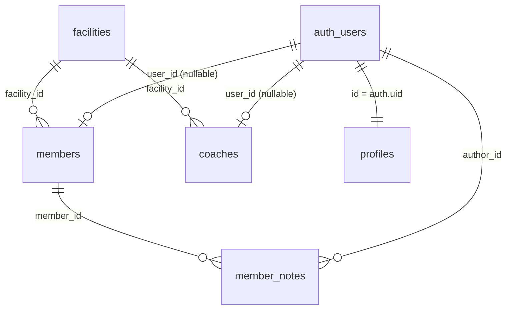
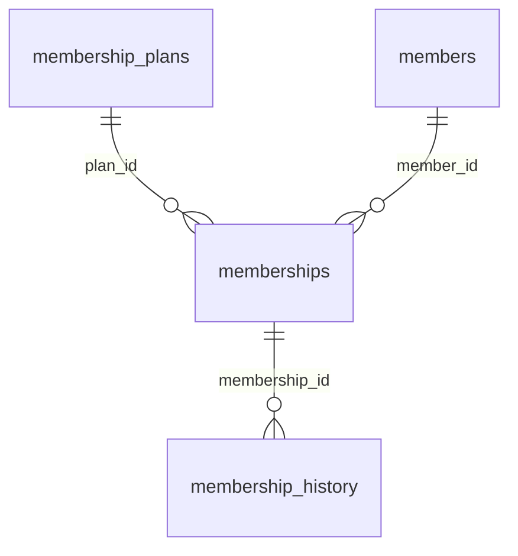
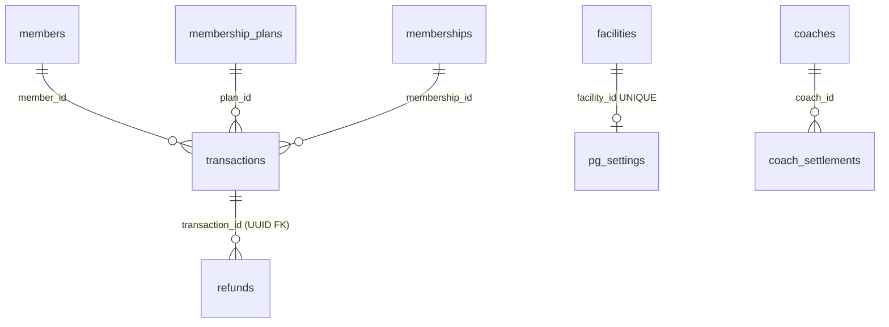
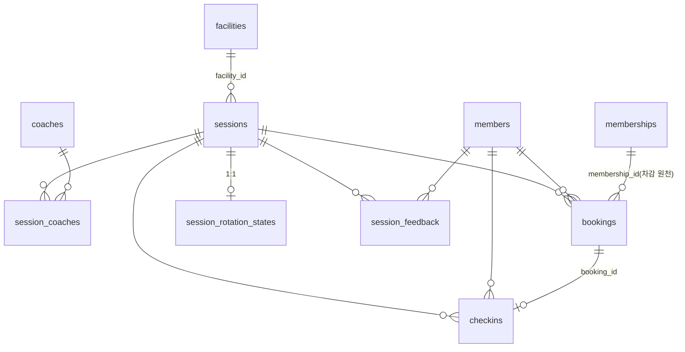
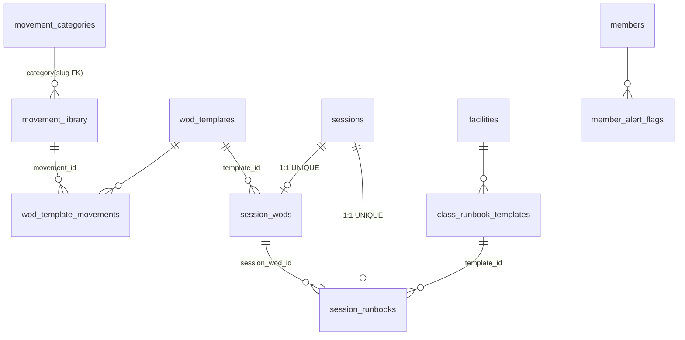
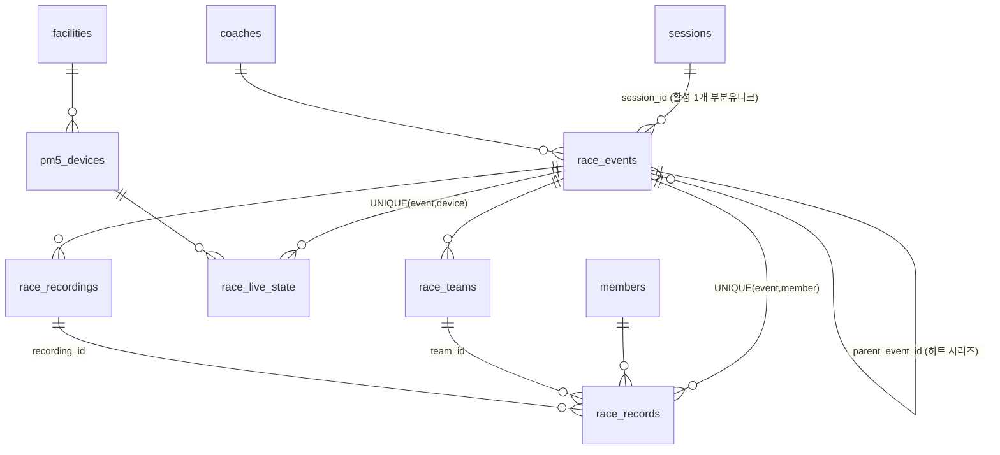
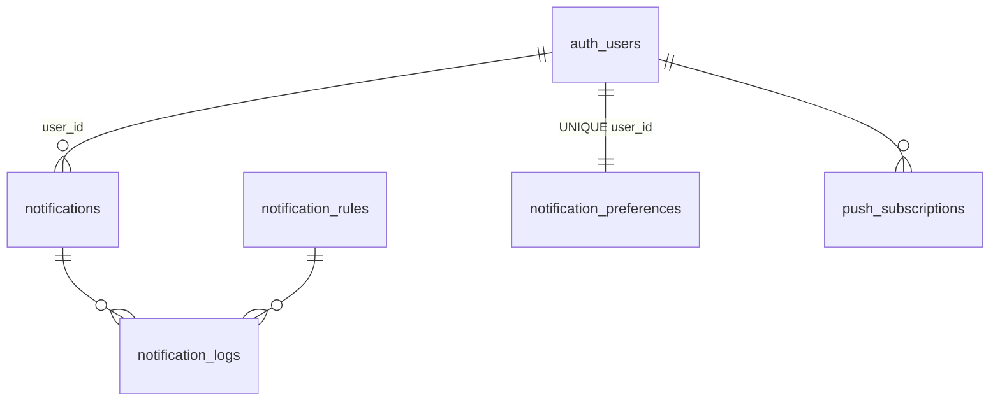
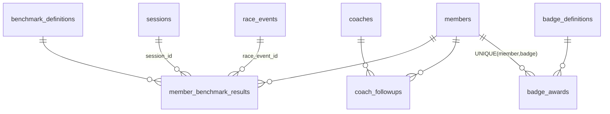
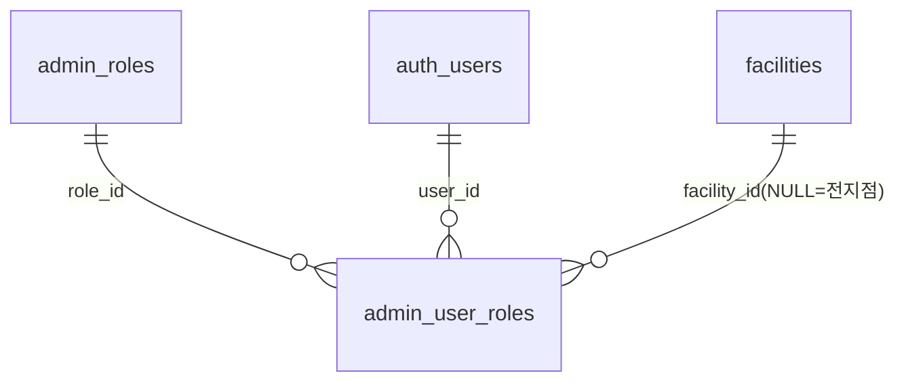

# 07. 데이터 모델 — Supabase 재설계 설계도 (to-be)

> **위치**: `.docs/rebuild/07-data-model.md` · **실행 DDL**: `.docs/rebuild/sql/00~09` (10파일, 순서 적용)
> **선행 계약**: `_source/contract.md` (표준 명칭·권한 모델·envelope — 본 문서는 계약의 구현 명세)
> **표기**: ✅ 운영 승계 · 🟡 코드완료 승계 · 🧪 mock · ⏳ 신규 설계 · 🔄 to-be 변경/통합

이 문서는 재구축 작업자가 **이것만 보고 Supabase 프로젝트를 다시 세울 수 있는** 데이터 계층의 단일 명세다.
as-is 31개 마이그레이션(~45테이블, ~40 RPC)을 검수해 통합·간소화한 to-be를 정의하며,
모든 변경의 근거는 §10 「as-is → to-be 변경 대조표」에 남긴다.

---

## 0. 파일 구성과 적용 순서

```
sql/
├── 00_extensions_helpers.sql   # pgcrypto/pg_net/pg_cron + is_admin()/is_admin_or_coach()
│                               # + current_member_id() + updated_at 트리거 fn + Storage 버킷 4종
├── 01_core.sql                 # facilities / profiles / members / coaches / member_notes(🔄통합)
│                               # + auth.users INSERT 트리거(가입 즉시 profiles pending + members)
├── 02_membership_finance.sql   # membership_plans / memberships / membership_history
│                               # / transactions(🔄UUID) / refunds / pg_settings / coach_settlements
├── 03_sessions_bookings.sql    # sessions(🔄wod_description 제거) / session_coaches / bookings(🔄상태 분리)
│                               # / checkins / session_rotation_states / session_feedback
├── 04_wod_runbook.sql          # movement_categories(시드8) / movement_library / wod_templates(+movements)
│                               # / session_wods / class_runbook_templates / session_runbooks / member_alert_flags
├── 05_race.sql                 # pm5_devices / race_events(🔄group·heat) / race_teams / race_live_state
│                               # / race_recordings / race_records
├── 06_notification.sql         # notifications / rules / logs / preferences / push_subscriptions
│                               # + 사이드이펙트·빈자리 트리거 + 리마인더·만기 크론 fn + cron.schedule 2건
├── 07_performance_badges.sql   # benchmark_definitions(시드6) / member_benchmark_results / coach_followups
│                               # + ⏳badge_definitions(시드12) / badge_awards + 판정 트리거 4종
├── 08_rbac_supplementary.sql   # admin_roles(시드4, 🔄JSONB 단일형) / admin_user_roles / notices / banners
│                               # / support_tickets / faqs / lockers(🔄단일화) / qr_codes / kiosk_devices
│                               # / audit_logs / system_config / widget_settings(🔄4→1)
└── 09_rpc.sql                  # 표준 RPC 전수 + _assert 게이트 2종 + 부속 결제 함수 + REVOKE/GRANT
```

- **의존 순서 고정**: 00 → 01 → … → 09. 각 파일 헤더에 의존이 주석으로 명시돼 있다.
- **멱등**: 전부 `IF NOT EXISTS` / `CREATE OR REPLACE` / `ON CONFLICT DO NOTHING` — 재실행 안전.
- **시드 최소셋**: 운동 카테고리 8종 · 벤치마크 6종 · 배지 12종 · admin_roles 4종.
  (운동 라이브러리 35종·벤치마크 WOD 10종의 대형 시드는 as-is `p1a_class_standardization.sql §F`를 별도 seed 스크립트로 재사용)

---

## 1. 데이터 계층 불변 규칙 (전 도메인 공통)

| # | 규칙 | 구현 |
|---|---|---|
| R1 | **권한 판정 단일 소스** = `profiles.role` + `profiles.approval_status` | RLS 헬퍼 `is_admin()`/`is_admin_or_coach()` 2종만. 세부 화면 권한은 `fn_my_permissions()` 1함수 |
| R2 | **비즈니스 테이블은 `member_id`만 참조** (user_id 직접 참조 금지) | user_id는 profiles/members/coaches의 auth 연결 컬럼과 알림·감사 계열에만 존재. RPC는 `current_member_id()`로 해석 |
| R3 | **클라이언트가 사용자 식별자를 전달하지 않는다** | 전 RPC `SECURITY DEFINER + SET search_path=public` + 내부 `auth.uid()` 검증 |
| R4 | **응답 envelope 1종**: `{success, data, error}` | 09_rpc 전 함수. as-is의 status 필드 혼용 폐지 |
| R5 | **쓰기 하드닝 표준**: SELECT=역할별, INSERT/UPDATE=admin+coach(도메인별), DELETE=admin | 세션 귀속 리소스는 "배정 코치"로 추가 제한 |
| R6 | **anon 접근 전면 차단이 기본값** — 예외는 화이트리스트만 | §7 RLS 매트릭스 및 05-class-portal §6.1: `session_rotation_states` SELECT, race 4테이블 SELECT, 공개 RPC 5종(fn_kiosk_checkin + Class 4종) |
| R7 | **결제 안전 불변식**: 금액은 서버 재계산, Toss 원본 불변 보존, `payment_mode` 기본 simulation | transactions.toss_raw_data, pg_settings.payment_mode |
| R8 | **Race 3경로 분리**: Broadcast(0.3s, DB 미기록) / race_live_state(5s, 종료 시 DELETE) / JSONL→race_records(멱등) | §4.6, 15-race-system |
| R9 | **출결 이중 기록**: 사실=`checkins`(append-only) / 판정=`bookings.attendance_outcome` | fn_mark_attendance·fn_kiosk_checkin이 원자적으로 동기화 |
| R10 | **동시성 advisory lock 대상 3곳**: 예약 정원(세션), PR 판정(회원×종목), Race 세션 준비(세션) | `pg_advisory_xact_lock(hashtext(...))` |
| R11 | **인증 트리거는 email_confirmed_at 의존 금지** — Auth 'Confirm email' OFF 확정 | auth.users INSERT 즉시 profiles(pending)+members 생성, 가입 즉시 세션 발급 → pending-approval 격리 |

---

## 2. 상태머신 · enum 표준 전수

> 모든 CHECK 제약의 허용값. 앱 코드의 타입/상수는 이 표에서 생성한다. **여기 없는 값 사용 금지.**

| 도메인 | 컬럼 | 허용값 (기본값 굵게) | 비고 |
|---|---|---|---|
| core | `profiles.role` | admin / coach / **member** | RLS 판정 단일 소스 |
| core | `profiles.approval_status` | **pending** / approved / rejected | 가입 승인 워크플로우 |
| core | `members.status` | **active** / inactive / suspended | |
| core | `members.gender` | male / female / other / NULL | |
| core | `member_notes.author_role` | admin / **coach** | 🔄 2테이블 통합의 구분자 |
| core | `member_notes.note_type` | **general** / injury / progress / caution / counseling | counseling=구 members.counseling_notes 이관 |
| core | `coaches.status` | **active** / inactive / on_leave | 소문자만(as-is 'Inactive' 혼용 정리) |
| membership | `membership_plans.type` | period / count | |
| membership | `memberships.status` | **active** / paused / expired / cancelled | 🔄 paused 정식 추가 |
| membership | `membership_history.action_type` | created / extended / paused / resumed / credit_adjusted / transferred / cancelled | |
| finance | `transactions.status` | **pending** / completed / failed / cancelled / refunded / partial_refunded | 🔄 payment_status·status 혼용 → 1컬럼 |
| finance | `transactions.transaction_type` | **purchase** / refund / adjustment | |
| finance | `transactions.category` | **membership** / pt / goods / locker / etc | |
| finance | `transactions.source` | online / pos / **manual** | |
| finance | `refunds.status` | **pending** / approved / completed / rejected | |
| finance | `pg_settings.payment_mode` | **simulation** / live | 결제 이중장치 |
| finance | `coach_settlements.status` | **pending** / confirmed / paid | confirmed 이후 자동 재계산 금지 |
| sessions | `sessions.status` | **scheduled** / in_progress / completed / cancelled | |
| sessions | `sessions.intensity_level` | beginner / intermediate / advanced / NULL | |
| sessions | `bookings.status` | **confirmed** / waitlisted / cancelled | 🔄 예약 수명주기 3종으로 정규화(no_show·waitlist 표기 제거) |
| sessions | `bookings.booking_type` | **regular** / trial / makeup | |
| sessions | `bookings.attendance_outcome` | **pending** / checked_in / no_show / late_cancel / coach_excused / walk_in | 운영 판정 — status와 역할 분리 |
| sessions | `checkins.checkin_method` | **qr** / kiosk / manual / manual_coach | |
| wod | `wod_templates.template_kind` | **daily** / benchmark / skill / strength / conditioning | |
| wod | `wod_templates.format_type` (=`session_wods.format_override`) | for_time / amrap / emom / tabata / chipper / strength / custom / station_circuit / NULL | station_circuit 포함 |
| wod | `session_wods.publish_state` | **draft** / published / archived | Class 노출은 published만 |
| wod | `member_alert_flags.flag_type` | trial / injury / renewal_due / returning_after_absence / vip_attention | |
| wod | `member_alert_flags.severity` | **info** / warning / critical | |
| race | `race_events.event_type` | **rowing** / bike / skierg / run / other | R-11 트랙/이펙트 비주얼 테마 결정 소스(15 §5b.3b) |
| race | `race_events.race_format` | **individual** / team / **group(🔄신규)** / relay | 경기 모드 3종+릴레이 |
| race | `race_events.status` | **scheduled** / in_progress / completed / cancelled | |
| race | `race_events.lobby_status` | **setup** → lobby → countdown → racing → finished | 진행 상태머신(부정출발 완화: READY 중 무시) |
| race | `pm5_devices.device_type` | **rower** / bike / skierg / treadmill / other | R-11 레인 캐릭터 테마 결정 소스 |
| race | `pm5_devices.status` | online / **offline** / maintenance | |
| race | `pm5_devices.current_mode` | **idle** / racing / personal_recording | 기기 모드락 |
| race | `race_live_state.connection_status` | **connected** / racing / idle / disconnected / offline | |
| notification | `notifications.category` | class_reminder / waitlist_vacancy / membership_expiry / promotion / checkin / badge / **system** | |
| notification | `notifications.type` | **info** / success / warning / error / urgent | urgent=외부 채널 발송 조건 |
| notification | `notifications.channel` | **in_app** / push / kakao / sms / email | |
| notification | `notification_rules.trigger_type` | class_reminder / membership_expiry / waitlist_vacancy / absence / birthday / manual | |
| notification | `notification_logs.status` | **pending** / sent / failed / read | |
| performance | `benchmark_definitions.metric_type` | time / reps / weight / distance / calories | time=낮을수록 우수(유일 규칙) |
| performance | `coach_followups.followup_type` | injury / trial_conversion / renewal / absence / motivation | |
| performance | `coach_followups.priority` | low / **normal** / high | |
| performance | `coach_followups.status` | **open** / completed / dismissed | |
| performance | `badge_definitions.category` | attendance / performance / race / membership / special | ⏳ |
| performance | `badge_definitions.metric_type` | checkin_count / checkin_streak_weeks / pr_count / race_count / race_podium_count / membership_days / manual | ⏳ |
| performance | `badge_awards.source` | **auto** / manual | |
| supplementary | `notices.category` | **general** / schedule / event / maintenance / emergency | |
| supplementary | `notices.priority` | urgent / high / **normal** / low | |
| supplementary | `banners.position` | **home_top** / home_mid / home_bottom / popup / event | 🔄 한글값 → 슬러그 |
| supplementary | `support_tickets.category` | **inquiry** / complaint / suggestion / refund | |
| supplementary | `support_tickets.status` | **open** / in_progress / resolved / closed | |
| supplementary | `support_tickets.priority` | low / **normal** / high / urgent | |
| supplementary | `lockers.size` | S / **M** / L | |
| supplementary | `lockers.status` | **available** / occupied / maintenance / disabled | occupied↔assigned_member_id 정합 CHECK |
| supplementary | `kiosk_devices.status` | **active** / offline / maintenance | |
| supplementary | `qr_codes.qr_type` | facility / session / member | |

**핵심 상태머신 전이 규칙**

```
bookings.status:        confirmed ⇄ waitlisted → cancelled   (승급 시 waitlist_promoted_at 기록)
attendance_outcome:     pending → checked_in | no_show | late_cancel | coach_excused
                        (walk_in은 예약 없는 현장 참가 시 booking 생성과 동시 부여)
                        코치 판정(attendance_marked_by 有)은 키오스크가 덮어쓰지 않는다
session_wods:           draft → published → archived  (published 스냅샷은 템플릿 변경 무영향)
race_events.lobby:      setup → lobby → countdown → racing → finished  (역행 금지, 히트 전환은 새 이벤트)
memberships.status:     active ⇄ paused → expired | cancelled  (pause_count ≤ plan.max_pauses)
refunds.status:         pending → approved → completed | rejected
coach_settlements:      pending → confirmed → paid  (confirmed 이후 fn_calculate가 덮어쓰지 않음)
profiles.approval:      pending → approved | rejected  (admin 전용 전이)
```

---

## 3. 도메인별 스키마 (1/2) — core · membership · finance · sessions

### 3.1 core (`01_core.sql`)



**facilities** — 지점 ✅

| 컬럼 | 타입 | 제약 | 기본값 | 설명 |
|---|---|---|---|---|
| id | UUID | PK | gen_random_uuid() | |
| name | VARCHAR(100) | NOT NULL | | |
| address / phone | TEXT / VARCHAR(20) | | | |
| operating_hours | JSONB | | '{}' | 요일별 운영시간 |
| latitude / longitude | NUMERIC(10,7) | | | 지도 연동 |
| photos | TEXT[] | | '{}' | Storage facility-photos |
| terms_of_service / privacy_policy / refund_policy | TEXT | | | 약관 원문 |
| is_active | BOOLEAN | NOT NULL | true | |
| created_at / updated_at | TIMESTAMPTZ | NOT NULL | now() | updated_at 트리거 |

**profiles** — 인증 게이트 ✅🔄

| 컬럼 | 타입 | 제약 | 기본값 | 설명 |
|---|---|---|---|---|
| id | UUID | PK, FK auth.users ON DELETE CASCADE | | = auth.uid() |
| email / name | VARCHAR(255)/(100) | | | |
| role | VARCHAR(10) | CHECK(admin/coach/member) | 'member' | **RLS 판정 단일 소스** |
| approval_status | VARCHAR(10) | CHECK(pending/approved/rejected) | 'pending' | 가입 승인 워크플로우 |
| approved_at / approved_by | TIMESTAMPTZ / UUID FK | | | |
| rejected_reason | TEXT | | | |
| created_at / updated_at | TIMESTAMPTZ | NOT NULL | now() | |

인덱스: `(role, approval_status)` — 승인 대기 목록·역할 스캔.
쓰기 규칙: **본인 UPDATE 정책 없음**(role/approval 자가 변경 차단). 변경은 admin RLS 또는 RPC만.

**members** — 회원 ✅🔄

| 컬럼 | 타입 | 제약 | 기본값 | 설명 |
|---|---|---|---|---|
| id | UUID | PK | gen_random_uuid() | 비즈니스 참조의 기준(R2) |
| user_id | UUID | UNIQUE, FK auth.users ON DELETE SET NULL | | NULL=계정 미연결(오프라인 등록) |
| facility_id | UUID | FK facilities | | |
| name | VARCHAR(100) | NOT NULL | | |
| email / phone | VARCHAR(255)/(20) | | | |
| birthday | DATE | | | |
| gender | VARCHAR(10) | CHECK 또는 NULL | | |
| emergency_contact | VARCHAR(50) | | | |
| medical_notes | TEXT | | | |
| avatar_url | TEXT | | | Storage avatars |
| preferences | JSONB | NOT NULL | '{}' | 앱 설정 |
| status | VARCHAR(20) | CHECK(active/inactive/suspended) | 'active' | |
| is_blacklisted / blacklist_reason | BOOLEAN / TEXT | NOT NULL / | false / | |
| created_at / updated_at | TIMESTAMPTZ | NOT NULL | now() | |

🔄 **제거 컬럼**: `locker_number`(→ lockers.assigned_member_id), `counseling_notes`(→ member_notes note_type=counseling).
인덱스: `user_id`(부분) / `(facility_id, status)` / `name`(Admin 검색).

**coaches** — 코치 ✅

| 컬럼 | 타입 | 제약 | 기본값 | 설명 |
|---|---|---|---|---|
| id | UUID | PK | gen_random_uuid() | |
| user_id | UUID | UNIQUE, FK auth.users SET NULL | | 계정 연결 |
| facility_id | UUID | FK facilities | | |
| name / email / phone | VARCHAR | name NOT NULL | | |
| specialties | TEXT[] | | '{}' | |
| bio / profile_image_url | TEXT | | | |
| base_salary / session_allowance | INTEGER | NOT NULL | 0 | 정산 파라미터(원) |
| status | VARCHAR(20) | CHECK(active/inactive/on_leave) | 'active' | 소문자만 |
| linked_at / linked_by | TIMESTAMPTZ / UUID FK | | | promote_to_coach 기록 |
| created_at / updated_at | TIMESTAMPTZ | NOT NULL | now() | |

**member_notes** — 회원 메모 통합 🔄 (as-is coaching_notes + member_notes → 1테이블)

| 컬럼 | 타입 | 제약 | 기본값 | 설명 |
|---|---|---|---|---|
| id | UUID | PK | gen_random_uuid() | |
| member_id | UUID | NOT NULL, FK members CASCADE | | |
| author_id | UUID | FK auth.users SET NULL | | 작성자 |
| author_role | VARCHAR(10) | CHECK(admin/coach) | 'coach' | 구 2테이블 구분 흡수 |
| note_type | VARCHAR(20) | CHECK(general/injury/progress/caution/counseling) | 'general' | |
| content | TEXT | NOT NULL | | |
| created_at / updated_at | TIMESTAMPTZ | NOT NULL | now() | |

인덱스: `(member_id, created_at DESC)` / `(note_type, created_at DESC)`.

**auth 연동 트리거** `handle_new_auth_user()` (R11): auth.users INSERT 즉시 → profiles(role=member, approval=pending) 생성 + 동일 이메일 미연결 members 연결(없으면 신규). **email_confirmed_at 의존 금지** — Confirm email OFF 확정, `/auth/email-verify` 라우트 폐지.

---

### 3.2 membership (`02_membership_finance.sql` 전반부)



**membership_plans** ✅

| 컬럼 | 타입 | 제약 | 기본값 | 설명 |
|---|---|---|---|---|
| id | UUID | PK | gen_random_uuid() | |
| facility_id | UUID | FK facilities SET NULL | | NULL=전 지점 공용 |
| name | VARCHAR(100) | NOT NULL | | |
| type | VARCHAR(10) | CHECK(period/count) | | + `chk_plan_type`(형별 필수 필드) |
| duration_days / credit_count | INT | 형별 필수 | | |
| price / discount_price | NUMERIC(12,0) | price NOT NULL, ≥0 | | 원화 정수 |
| description | TEXT | | | |
| refund_policy | JSONB | NOT NULL | '{}' | {"within_7days":1.0,...} |
| max_pauses | INT | NOT NULL | 0 | |
| facility_sharing | BOOLEAN | NOT NULL | false | |
| is_active | BOOLEAN | NOT NULL | true | |
| created_at / updated_at | TIMESTAMPTZ | NOT NULL | now() | |

**memberships** ✅🔄

| 컬럼 | 타입 | 제약 | 기본값 | 설명 |
|---|---|---|---|---|
| id | UUID | PK | gen_random_uuid() | |
| member_id | UUID | NOT NULL, FK members CASCADE | | |
| plan_id | UUID | FK plans SET NULL | | |
| start_date / end_date | DATE | start NOT NULL | | |
| remaining_credits | INT | ≥0 또는 NULL | | 횟수제만. 증감은 RPC 전용 |
| status | VARCHAR(10) | CHECK(active/paused/expired/cancelled) | 'active' | 🔄 paused 정식화 |
| pause_count / paused_at / pause_reason | INT / TIMESTAMPTZ / TEXT | | 0 | |
| created_at / updated_at | TIMESTAMPTZ | NOT NULL | now() | |

인덱스: `(member_id, status, end_date DESC)` — 회원 상세 활성권 / `end_date WHERE status='active'`(부분) — 만기 크론 스캔.

**membership_history** ✅ — action_type CHECK 7종, `(membership_id, created_at DESC)` 인덱스. 모든 상태 변경은 기록 후 갱신.

---

### 3.3 finance (`02_membership_finance.sql` 후반부)



**transactions** 🔄 (id text → **UUID**)

| 컬럼 | 타입 | 제약 | 기본값 | 설명 |
|---|---|---|---|---|
| id | UUID | PK | gen_random_uuid() | 🔄 외부 식별자와 PK 분리 |
| member_id / facility_id / membership_id / plan_id | UUID | FK (SET NULL) | | |
| order_id | TEXT | UNIQUE | | Toss orderId |
| payment_key | TEXT | | | Toss paymentKey |
| amount | NUMERIC(12,0) | NOT NULL, ≥0 | | 서버 재계산 값만(R7) |
| status | VARCHAR(15) | CHECK 6종 | 'pending' | 🔄 payment_status 혼용 정리 |
| transaction_type | VARCHAR(15) | CHECK(purchase/refund/adjustment) | 'purchase' | |
| category | VARCHAR(20) | CHECK 5종 | 'membership' | |
| payment_method | VARCHAR(50) | | | |
| source | VARCHAR(10) | CHECK(online/pos/manual) | 'manual' | |
| toss_status / cancel_reason / receipt_url | TEXT | | | |
| cancel_amount | NUMERIC(12,0) | | | |
| cancelled_at | TIMESTAMPTZ | | | |
| toss_raw_data | JSONB | NOT NULL | '{}' | 승인 응답 불변 원본 |
| created_at / updated_at | TIMESTAMPTZ | NOT NULL | now() | |

인덱스(복합 위주): `(member_id, created_at DESC)` 회원 이력 / `(status, created_at DESC)` 매출 리포트 / `(facility_id, created_at DESC)` 지점 리포트 / `order_id` UNIQUE(콜백 조회).
쓰기: 클라이언트 직접 INSERT 금지 — 서버 라우트(Service Role)·admin만.

**refunds** ✅🔄 — transaction_id **UUID NOT NULL FK(RESTRICT)** (구 text FK 정합 해소). amount>0, penalty_amount≥0, status CHECK 4종, toss_cancel_key, processed_by. 인덱스 `(transaction_id)`, `(status, created_at DESC)`.

**pg_settings** ✅ — facility_id **UNIQUE**(지점당 1행 — as-is 무제약 정리). `*_encrypted` 컬럼은 pgp_sym(RPC `save_pg_settings` 전용 기록). `payment_mode` CHECK(simulation/live) 기본 simulation — 실결제 전환의 유일한 스위치. RLS admin 전용(코치 포함 비노출).

**coach_settlements** ✅ — UNIQUE(coach_id, year_month), year_month `^\d{4}-\d{2}$` CHECK. status pending→confirmed→paid (확정 후 `fn_calculate_monthly_settlement` 재계산이 덮어쓰지 않음 — WHERE status='pending' 가드).

---

### 3.4 sessions (`03_sessions_bookings.sql`)



**sessions** 🔄 (`wod_description` **제거** — WOD는 session_wods가 유일 소스)

| 컬럼 | 타입 | 제약 | 기본값 | 설명 |
|---|---|---|---|---|
| id | UUID | PK | gen_random_uuid() | |
| facility_id | UUID | NOT NULL, FK CASCADE | | |
| title | VARCHAR(200) | NOT NULL | | |
| description | TEXT | | | |
| class_type | VARCHAR(40) | | | 런시트 템플릿 매칭 키 |
| session_date | DATE | NOT NULL | | |
| start_time / end_time | TIME | NOT NULL | | |
| capacity | INT | NOT NULL, >0 | 15 | |
| intensity_level | VARCHAR(15) | CHECK 3종/NULL | | |
| status | VARCHAR(15) | CHECK 4종 | 'scheduled' | |
| created_at / updated_at | TIMESTAMPTZ | NOT NULL | now() | |

인덱스: `(facility_id, session_date, start_time)` 캘린더 / `(session_date, status)` KPI 월 집계·리마인더 크론.

**session_coaches** ✅ — UNIQUE(session_id, coach_id), assignment_role CHECK(lead/assistant) 기본 lead, display_order. 인덱스 `(coach_id, session_id)`(코치 역방향 조회 — as-is 단일컬럼 인덱스 대체).

**bookings** 🔄 — 상태머신 정규화의 핵심 (§2 전이 규칙 참조)

| 컬럼 | 타입 | 제약 | 기본값 | 설명 |
|---|---|---|---|---|
| id | UUID | PK | gen_random_uuid() | |
| session_id / member_id | UUID | NOT NULL, FK CASCADE, UNIQUE 쌍 | | 세션당 회원 1행 |
| membership_id | UUID | FK memberships SET NULL | | 크레딧 차감 원천 |
| status | VARCHAR(10) | CHECK(confirmed/waitlisted/cancelled) | 'confirmed' | 예약 수명주기만 |
| booking_type | VARCHAR(10) | CHECK(regular/trial/makeup) | 'regular' | |
| credit_used | BOOLEAN | NOT NULL | false | 🔄 환원 정합의 유일 근거 |
| attendance_outcome | VARCHAR(15) | CHECK 6종 | 'pending' | 운영 판정(fn_mark_attendance 전용) |
| attendance_marked_at / attendance_marked_by | TIMESTAMPTZ / UUID FK | | | 판정자 추적 |
| waitlist_promoted_at | TIMESTAMPTZ | | | 승급 기록 |
| cancel_reason | TEXT | | | |
| created_at / updated_at | TIMESTAMPTZ | NOT NULL | now() | |

인덱스: `(session_id, status)` 세션 보드 / `(member_id, created_at DESC)` 내 예약 / `attendance_outcome WHERE <> 'pending'`(부분) KPI / `(session_id, created_at) WHERE status='waitlisted'`(부분) 대기열 순번.
쓰기: member 직접 INSERT/UPDATE 정책 없음 — `fn_book_with_credit`/`fn_cancel_booking_with_credit`/`fn_mark_attendance` RPC 경유(정원·크레딧 검증 우회 차단).

**checkins** ✅🔄 — append-only 사실 로그

| 컬럼 | 타입 | 제약 | 기본값 |
|---|---|---|---|
| id | UUID | PK | gen_random_uuid() |
| booking_id | UUID | FK SET NULL | |
| member_id | UUID | NOT NULL, FK CASCADE | |
| session_id | UUID | FK SET NULL (NULL=자유 출입) | |
| facility_id | UUID | FK SET NULL | |
| checkin_time | TIMESTAMPTZ | NOT NULL | now() |
| checkin_method | VARCHAR(15) | CHECK(qr/kiosk/manual/manual_coach) | 'qr' |
| notes / created_at | TEXT / TIMESTAMPTZ | | now() |

인덱스: 🔄 **부분 UNIQUE `(session_id, member_id) WHERE session_id IS NOT NULL`** — 세션당 1회 체크인 DB 보장(as-is는 앱 로직만). `(member_id, checkin_time DESC)` / `(facility_id, checkin_time DESC)`.

**session_rotation_states** ✅ — 세션 1:1 PK(session_id). 서킷 타이머(current_round/total_rounds/seconds_per_round/is_running/timer_started_at/paused_remaining_seconds/team_assignments JSONB). **anon SELECT 의도적 공개**(TV HUD — RLS 예외 화이트리스트), 쓰기는 admin+배정 코치.

**session_feedback** ✅ (계약 보정으로 정식 등재) — UNIQUE(session_id, member_id), rating 1~5 NOT NULL, comment, admin_response/responded_by/responded_at. 인덱스 `(created_at DESC)` 관리 목록 / `(coach_id, rating)` 코치 평점 집계. RLS: member 본인 INSERT+읽기, staff 읽기, admin 응답 UPDATE.

---

## 4. 도메인별 스키마 (2/2) — wod · race · notification · performance · rbac · supplementary

### 4.1 wod (`04_wod_runbook.sql`) — ※ 레거시 `wods` 테이블은 to-be에서 **생성하지 않음(폐지)**



**movement_categories** ✅ (시드 8종: weightlifting/gymnastics/monostructural/dumbbell/kettlebell/medball/other_equipment/accessory)

| 컬럼 | 타입 | 제약 | 기본값 |
|---|---|---|---|
| id | UUID | PK | gen_random_uuid() |
| slug | VARCHAR(40) | NOT NULL UNIQUE | |
| name_ko / name_en | VARCHAR(60) | NOT NULL | |
| color | VARCHAR(9) | | |
| sort_order | INT | NOT NULL | 0 |
| is_active | BOOLEAN | NOT NULL | true |
| created_at | TIMESTAMPTZ | NOT NULL | now() |

**movement_library** ✅🔄 — `category`는 **최초부터 movement_categories.slug FK**(ON UPDATE CASCADE, DELETE RESTRICT — as-is 하드코딩 CHECK→FK 전환 이력 흡수). slug UNIQUE, name_ko/en, equipment TEXT[], difficulty_level 1~5, primary_muscles TEXT[], coaching_points, thumbnail_url/video_url(Storage movement-media), source_tag, is_active. 인덱스 `(category, is_active)`.

**wod_templates** ✅ — facility_id NULL=글로벌 공유(벤치마크), template_kind 5종, format_type 8종(+station_circuit)/NULL, time_cap_minutes, rounds, description/public_notes(공개)/coach_notes(코치 전용), is_shared/is_benchmark, published_at, created_by/updated_by. 인덱스 `(facility_id, template_kind)` / `is_shared`·`is_benchmark`(부분).

**wod_template_movements** ✅ — sort_order, movement_id FK(SET NULL) 또는 custom_label (CHECK: 둘 중 하나 필수), target_value/unit, distance_meters, duration_seconds, load_male/female_rx, rx_notes, scaling_notes. 인덱스 `(wod_template_id, sort_order)`.

**session_wods** ✅ — 세션당 1행(UNIQUE session_id). publish_state draft→published→archived, source_version, *_override 4종(title/format/time_cap/description), **movements_snapshot JSONB**(발행 시점 동결 — 템플릿 변경 무영향), coach_notes/class_display_notes, edited_by/published_by/published_at. 인덱스 `published_at DESC WHERE published`(Class Display 최신분).

**class_runbook_templates** ✅ — facility_id NOT NULL, class_type(sessions.class_type 매칭), warmup/movement_prep/scaling_options/coach_cues/safety_notes/finish_notes, default_wod_template_id, is_default. 인덱스 `(facility_id, class_type)`.

**session_runbooks** ✅ — 세션 1:1(UNIQUE), template_id/session_wod_id, `*_override` 6종(**NULL=템플릿 상속**), published_at, updated_by.

**member_alert_flags** ✅ — flag_type 5종, severity 3종, starts_at/ends_at, note, created_by/resolved_by/resolved_at. **활성 판정 = resolved_at IS NULL AND (ends_at IS NULL OR ends_at > now())**. 부분 인덱스 `(member_id, flag_type) WHERE resolved_at IS NULL`.

---

### 4.2 race (`05_race.sql`)



**pm5_devices** ✅ — serial_number **UNIQUE = 주 식별자**(iOS MAC 숨김 대응), mac_address, ble_name, qr_identifier(Personal Recording 후속 Phase), device_type CHECK 5종(**R-11 레인 캐릭터 테마 소스**), status(online/offline/maintenance, 기본 offline), current_mode(기기 모드락 3종), firmware_version, last_sync_at. 인덱스 `(facility_id, status)`.

**race_events** 🔄 — 경기 모드 3종+히트 확장 (15-race-system §4b 확정본)

| 컬럼 | 타입 | 제약 | 기본값 | 설명 |
|---|---|---|---|---|
| id | UUID | PK | gen_random_uuid() | |
| facility_id / session_id / coach_id | UUID | FK SET NULL | | 세션 연동=fn_prepare_race_session |
| name | VARCHAR(200) | NOT NULL | | |
| event_date | DATE | NOT NULL | CURRENT_DATE | |
| event_type | VARCHAR(20) | CHECK(rowing/bike/skierg/run/other) | 'rowing' | **R-11 트랙/이펙트 테마 소스** |
| race_format | VARCHAR(15) | CHECK(individual/team/**group**/relay) | 'individual' | 🔄 group 신규 |
| target_distance_m | INT | | | 개인/팀/릴레이 목표. NULL=시간제 |
| duration_minutes | INT | | | 시간제 레이스 |
| group_target_m | INT | | | 🔄 단체전 A안 공동 목표 |
| heat_no | INT | NOT NULL | 1 | 🔄 단체전 B안 히트 번호(개인/팀전 항상 1) |
| parent_event_id | UUID | FK race_events SET NULL | | 🔄 히트 시리즈 루트 |
| carryover_m | NUMERIC(10,2) | NOT NULL | 0 | 🔄 공동목표 이월 누계 |
| description | TEXT | | | |
| status | VARCHAR(15) | CHECK 4종 | 'scheduled' | |
| lobby_status | VARCHAR(15) | CHECK 5종 | 'setup' | 진행 상태머신 |
| created_at / updated_at | TIMESTAMPTZ | NOT NULL | now() | |

인덱스: **부분 UNIQUE `uq_race_events_active_session(session_id) WHERE 미종료`** — 세션당 활성 이벤트 1개(R-8) / `(facility_id, event_date DESC)` / `status WHERE in_progress`(부분) / `parent_event_id`(부분, 히트 시리즈 집계).
히트 통합 랭킹: `COALESCE(parent_event_id, id)` 시리즈 기준 race_records 집계 — records 스키마는 오염 없음.

**race_teams** ✅ — UNIQUE(event_id, team_name), team_color 기본 '#FF6A00', total_distance_m(종료 시 확정 합산 — 실시간은 Broadcast).

**race_live_state** ✅ — UNIQUE(event_id, device_id). 5초 스냅샷(재접속 복원 전용), lane_number, member_id/team_id, distance_m/power_w/stroke_rate_spm/hr_bpm/calories_burned/max_watts, connection_status 5종, last_updated_at. **이벤트 종료 시 DELETE**(3경로 원칙). 인덱스 `device_id`.

**race_recordings** ✅ — JSONL 메타(file_path/file_size_bytes/total_data_points/duration_seconds). 본체는 race-service 로컬 30일. 인덱스 `(event_id, device_serial)` — 멱등 적재 경로.

**race_records** ✅ — UNIQUE(event_id, member_id) 멱등. result_time INTERVAL, result_distance, calories_burned, avg/max_watts, avg_spm, avg_pace INTERVAL, avg/max_hr_bpm, lane_number, finish_rank, is_pr, team_id/recording_id/device_serial. 인덱스 `(event_id, device_serial)` 적재 / `(member_id, created_at DESC)` 퍼포먼스 이력.
연동: INSERT → `trg_badges_on_race_record`(배지 판정) + `fn_get_member_performance_profile` 소스.

---

### 4.3 notification (`06_notification.sql`)



**notifications** ✅ — user_id NOT NULL FK, member_id, title, **content**(구 message 표기 통일), category 7종/type 5종/channel 5종, action_url, metadata JSONB(중복 발송 방지 키 보관), is_read/read_at. 인덱스 `(user_id, created_at DESC) WHERE NOT is_read`(부분) / `(user_id, category, created_at DESC)`(dedupe 조회).

**notification_rules** ✅ — trigger_type 6종, trigger_config JSONB, title/message_template, channels TEXT[], is_active. RLS 🔄 admin 전용(as-is 전체 읽기 제거).

**notification_logs** ✅ — rule_id/notification_id/user_id, channel, status 4종, sent_at/read_at/error_message. RLS 🔄 admin 전용(타인 로그 노출 차단).

**notification_preferences** ✅🔄 — **user_id UNIQUE**(as-is 무제약 정리). 카테고리 토글 6종 + push/kakao/sms/email_enabled + **celebrate_opt_in**(🔄 Class PR 티커 공개 동의) + quiet_hours. 없으면 전 채널 기본 허용으로 간주.

**push_subscriptions** ✅🔄 — **endpoint UNIQUE**(중복 구독 방지). p256dh_key/auth_key(VAPID), device_type/user_agent, is_active, last_used_at.

---

### 4.4 performance + badges (`07_performance_badges.sql`)



**benchmark_definitions** ✅ (시드 6종: 500m/1000m/2000m Row, Max Back Squat/Deadlift/Pull-ups) — name UNIQUE, metric_type 5종(time=낮을수록 우수), unit, facility_id NULL=공용, is_active.

**member_benchmark_results** ✅ — result_value NUMERIC(12,2) >0(time이면 초), result_meta JSONB, is_pr(기록 시점 판정 — advisory lock), session_id/race_event_id 연동, recorded_by/recorded_at. 인덱스 `(member_id, benchmark_id, recorded_at DESC)` / `recorded_at DESC WHERE is_pr`(부분 — PR 티커).

**coach_followups** ✅ — followup_type 5종, priority 3종, status 3종, due_date, note, completed_at. 인덱스 `(coach_id, due_date) WHERE open`(부분) / `(member_id, created_at DESC)`. **회원 비노출**(RLS coach 본인+admin).

**badge_definitions** ⏳ (as-is 마이그레이션 부재 → 최초 정식 설계. 시드 12종)

| 컬럼 | 타입 | 제약 | 기본값 | 설명 |
|---|---|---|---|---|
| id | UUID | PK | gen_random_uuid() | |
| slug | VARCHAR(60) | NOT NULL UNIQUE | | first-checkin, checkin-10/50/100, streak-4w, first-pr, pr-10, first-race, race-5, race-podium, member-90d, member-365d |
| name / description / icon | VARCHAR/TEXT | name NOT NULL | | icon=디자인 시스템 키 |
| category | VARCHAR(20) | CHECK 5종 | | |
| metric_type | VARCHAR(30) | CHECK 7종 | | manual=Admin 수동 수여 전용 |
| threshold_value | NUMERIC | NOT NULL >0 | 1 | |
| sort_order / is_active | INT / BOOLEAN | NOT NULL | 0 / true | |

**badge_awards** ⏳ — **UNIQUE(member_id, badge_id)**(중복 수여 원천 차단 — 판정 멱등의 기반), source(auto/manual), progress_value(수여 시점 지표), awarded_by, awarded_at.

**배지 판정 트리거 4종**: `trg_badges_on_checkin`(checkins INSERT) / `trg_badges_on_benchmark`(results INSERT, is_pr만) / `trg_badges_on_race_record`(race_records INSERT) / `trg_badges_on_membership`(memberships INSERT). 전부 wrapper가 `fn_evaluate_badges(member_id, trigger)`를 호출하며 **예외를 삼켜 원 트랜잭션을 실패시키지 않음**. 획득 시 notifications(category=badge) 자동 발행.

---

### 4.5 rbac (`08_rbac_supplementary.sql` 전반부)



**admin_roles** 🔄 — permissions **JSONB 단일형 강제**: `{"<권한그룹>": ["view","edit",...]}` 배열형 1종만(as-is 불리언맵/배열 혼재 해소, `jsonb_typeof='object'` CHECK). 와일드카드 `{"*":["all"]}`=super_admin(UI 편집 잠금). **권한 그룹 키 = Admin 14화면과 1:1**: dashboard/members/attendance/payments/plans/schedule/coaches/wod_studio/race/lockers/badges/feedback/crm/settings.
시드 4종: super_admin(`{"*":["all"]}`) / manager(운영 전반 view+edit) / staff(출석·회원·락커 중심) / viewer(읽기 전용).

**admin_user_roles** 🔄 (**권한 단일 소스로 승격** — as-is "UI 전용 미연동" 해소) — UNIQUE(user_id, role_id, facility_id), assigned_by/at. **게이트 순서**: ① `profiles.role='admin'`(RLS·라우트 진입) → ② `fn_my_permissions()`(화면·기능 단위). role=admin인데 매핑이 없으면 super_admin으로 간주(부트스트랩 잠금 방지 — fn_my_permissions 내 규칙).

### 4.6 supplementary (`08_rbac_supplementary.sql` 후반부)

**notices** ✅ — category 5종, priority 4종, is_pinned/is_published/published_at/expires_at. 부분 인덱스 `(facility_id, is_pinned DESC, published_at DESC) WHERE is_published`.

**banners** ✅🔄 — position 슬러그 5종(한글값 폐지), priority_order, start/end_date(CHECK end>start), is_active. 부분 인덱스 활성창.

**support_tickets** ✅ — category/status/priority CHECK, assigned_to, resolved_at. 인덱스 `(status, created_at DESC)` / `(member_id, created_at DESC)`.

**faqs** ⏳ — category, question/answer, sort_order, is_published. (회원 앱 고객센터)

**lockers** 🔄 — **삼중 구조(lockers + locker_assignments + members.locker_number) → 1테이블 단일화**

| 컬럼 | 타입 | 제약 | 기본값 | 설명 |
|---|---|---|---|---|
| id | UUID | PK | gen_random_uuid() | |
| facility_id | UUID | NOT NULL FK, UNIQUE(facility, locker_number) | | |
| locker_number | VARCHAR(20) | NOT NULL | | |
| size | VARCHAR(5) | CHECK(S/M/L) | 'M' | |
| monthly_fee | NUMERIC(12,0) | NOT NULL | 0 | |
| status | VARCHAR(15) | CHECK 4종 + **배정 정합 CHECK**(occupied ↔ assigned_member_id) | 'available' | |
| assigned_member_id | UUID | FK members SET NULL | | 현재 배정(단일 소스) |
| assigned_start_date / assigned_end_date | DATE | | | |
| memo | TEXT | | | |

배정 이력은 audit_logs(action=LOCKER_ASSIGN/RELEASE)로 기록 — 별도 이력 테이블 폐지. 부분 인덱스 `assigned_member_id` / `assigned_end_date WHERE occupied`(만기 스캔).

**qr_codes** ✅ — 고정 QR(facility/session/member)만. **회원 체크인 동적 QR({mid,fid,ts,v}, 5분)은 DB 미저장** — fn_kiosk_checkin이 검증. RLS admin 전용.

**kiosk_devices** ✅ — device_name/ip, status 3종, display_message, last_heartbeat(60s 미갱신=offline 표시). RLS admin 전용(단말은 Service Role/anon RPC 사용).

**audit_logs** ✅ — action/table_name/record_id/old·new_values/ip/user_agent. **append-only**(UPDATE/DELETE 정책 없음), 열람 admin 전용(as-is 전체 읽기 제거). 인덱스 `created_at DESC` / `(table_name, record_id)`.

**system_config** ✅ — config_key UNIQUE, config_value JSONB, category, is_secret(UI 마스킹), updated_by. 필수 키: `edge_base_url`, `edge_service_key`(알림 팬아웃 — 06 참조, Vault 권장).

**widget_settings** 🔄 — **위젯 4테이블(정의/인스턴스/레이아웃/AI생성 — 설계만 존재) → 1테이블 축소**. UNIQUE(facility_id, widget_key), title, config JSONB, is_enabled, sort_order. AI 생성기는 후순위 부록.

---

## 5. 인덱스 전략 요약

원칙: **쿼리 패턴 근거 복합 인덱스 위주** + 조건 스캔은 부분 인덱스. as-is의 관성적 단일컬럼 인덱스(예: bookings.status 단독, sessions.status 단독, members.email 단독 등)는 폐기하고 아래로 재산정했다.

| 쿼리 패턴 (화면/기능) | 인덱스 |
|---|---|
| Admin 캘린더·Class 보드: 시설+날짜 세션 | `sessions(facility_id, session_date, start_time)` |
| 코치 KPI 월 집계·리마인더 크론 | `sessions(session_date, status)`, `session_coaches(coach_id, session_id)` |
| 세션 보드 참석자 | `bookings(session_id, status)` |
| 회원 예약/결제/출석 이력 | `bookings(member_id, created_at DESC)`, `transactions(member_id, created_at DESC)`, `checkins(member_id, checkin_time DESC)` |
| 대기열 순번(FIFO) | `bookings(session_id, created_at) WHERE waitlisted` (부분) |
| 출결 KPI | `bookings(attendance_outcome) WHERE <> 'pending'` (부분) |
| 세션당 1회 체크인 보장 | `checkins(session_id, member_id) UNIQUE WHERE session_id IS NOT NULL` |
| 만기 D-n 크론 | `memberships(end_date) WHERE status='active'` (부분) |
| 매출 리포트 | `transactions(status, created_at DESC)`, `(facility_id, created_at DESC)` |
| Toss 콜백 | `transactions(order_id) UNIQUE` |
| 세션당 활성 Race 1개(R-8) | `race_events(session_id) UNIQUE WHERE 미종료` (부분) |
| Race 결과 멱등 적재 | `race_records(event_id, device_serial)`, `race_recordings(event_id, device_serial)`, `race_records(event_id, member_id) UNIQUE` |
| 미읽음 알림 | `notifications(user_id, created_at DESC) WHERE NOT is_read` (부분) |
| PR 티커 | `member_benchmark_results(recorded_at DESC) WHERE is_pr` (부분) |
| 활성 플래그/오픈 팔로업 | `member_alert_flags(member_id, flag_type) WHERE resolved_at IS NULL`, `coach_followups(coach_id, due_date) WHERE open` |

---

## 6. RLS 정책 매트릭스 (역할 × 테이블 × CRUD)

범례: `S`=SELECT, `I`=INSERT, `U`=UPDATE, `D`=DELETE. `own`=본인 행만(user_id/member 연결), `assigned`=배정 코치만, `pub`=게시분만, `−`=차단.
**anon 열이 −가 아닌 행 = 공개 화이트리스트 전부**다(R6). member/coach/admin은 approval_status=approved 전제.

| 테이블 | anon | member | coach | admin |
|---|---|---|---|---|
| facilities | − | S | S | SIUD |
| profiles | − | S(own) | S(own) | SIUD |
| members | − | S,U(own) | S | SIUD |
| coaches | − | S | S, U(own) | SIUD |
| member_notes | − | − | S,I,U | SIUD |
| membership_plans | − | S | S | SIUD |
| memberships | − | S(own) | S | SIUD (크레딧 증감=RPC) |
| membership_history | − | S(own) | − | SIUD |
| transactions | − | S(own) | − | SIUD (INSERT=서버 라우트/SRK) |
| refunds | − | S(own) | − | SIUD |
| pg_settings | − | − | − | SIUD (시크릿 마스킹) |
| coach_settlements | − | − | S(own) | SIUD |
| sessions | − | S | S | SIUD |
| session_coaches | − | S | S | SIUD |
| bookings | − | S(own) (쓰기=RPC) | S (판정=RPC) | SIUD |
| checkins | − | S(own) | S | SIUD (INSERT=RPC/키오스크) |
| session_rotation_states | **S** (TV HUD 의도적 공개) | S | S, IUD(assigned) | SIUD |
| session_feedback | − | S(own), I(own) | S | SIUD(응답) |
| movement_categories / movement_library | − | S | S,I,U | SIUD |
| wod_templates / wod_template_movements / class_runbook_templates | − | S | S,I,U | SIUD (D=admin) |
| session_wods / session_runbooks | − | S | S, IUD(assigned) | SIUD |
| member_alert_flags | − | − | S,I,U | SIUD |
| pm5_devices | − | S | S,I,U | SIUD |
| race_events / race_teams / race_live_state / race_records | **S** (🔄 Race TV 미인증 구동) | S | S,I,U (live_state는 D도 staff) | SIUD |
| race_recordings | − | S | S,I,U | SIUD |
| notifications | − | S,U(own — 읽음 처리) | S,U(own) | SIUD |
| notification_rules / notification_logs | − | − | − | SIUD (🔄 전체 읽기 제거) |
| notification_preferences / push_subscriptions | − | SIUD(own) | SIUD(own) | S(preferences) |
| benchmark_definitions | − | S | S,I,U | SIUD |
| member_benchmark_results | − | S(own) | S,I,U | SIUD |
| coach_followups | − | − (**회원 절대 비노출**) | SIUD(own coach) | SIUD |
| badge_definitions | − | S | S | SIUD |
| badge_awards | − | S(own) | S | SIUD (auto 수여=DEFINER RPC) |
| admin_roles | − | − | − | SIUD |
| admin_user_roles | − | S(own) | S(own) | SIUD |
| notices | − | S(pub) | S(pub) | SIUD |
| banners | − | S(활성창) | S(활성창) | SIUD |
| support_tickets | − | S(own), I(own) | − | SIUD |
| faqs | − | S(pub) | S(pub) | SIUD |
| lockers | − | S(own 배정분) | − | SIUD |
| qr_codes / kiosk_devices | − | − | − | SIUD |
| audit_logs | − | − | − | S (append-only, 쓰기=DEFINER fn) |
| system_config / widget_settings | − | − | − | SIUD |

**RPC 실행 권한(EXECUTE) 화이트리스트**
- anon + authenticated: `fn_kiosk_checkin`, `fn_get_class_display_wod`, `fn_get_class_live_board`, `fn_get_class_screen_prs`, `fn_get_class_leaderboard`
- authenticated 전용: 나머지 전부 (내부에서 역할 재검증)
- Service Role 전용(클라이언트 미노출): `get_decrypted_pg_settings`
